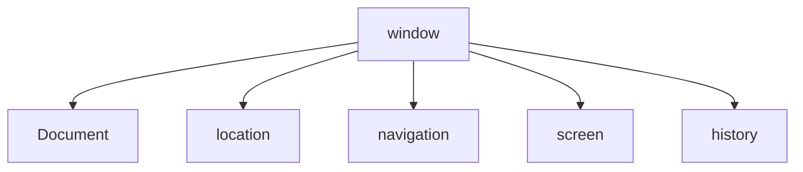

# javascript
## javascript 入门

##### javascript是什么
javascript 客户端的编程语言
javascript 是一种弱类型或说动态语言

##### javascript组成
ECMAScript(基础语法)、web APIs(DOM、BOM)

##### javascript位置
行内js，内部js，外部js

内部js，规范</body>前面书写

外部js，标签中间不要写代码，会被忽略

##### javascript两种注释方式
单行//
多行/*    */

##### javascript结束符
结束符;
可写可不写，统一风格就行。

##### javascript输入输出语句
输入：prompt('用户可输入框')
输出：alert('弹出框')   console('控制台全输出')

##### 变量是内存里存放数据的空间

##### 变量的使用
声明变量    var声明一个变量
赋值       把值存入这个变量中

##### 变量的扩展
更新变量
声明多个变量
声明不赋值结果underfind
不声明直接赋值也可使用，不推荐（隐式声明）

##### 变量的命名
大小写区别
不能以数字开头
不用使用关键字

##### 表达式

var a =1
a > 2 || a = 2  //左边为false，执行右边
a > 2 && a = 2	//左边为true，执行右边


#### 函数

函数的概念
封闭代码块，大量重复使用
> 是做某件事或者实现某种功能

**函数的2种声明方式**

1、利用函数关键字自定义函数命名函数
2、函数表达式(匿名函数)  var 变量名 = function() {}

（1）var后是变量名，不是函数名
（2）函数表达式声明方式跟声明变量差不多，只不过变量里面存的是值而函数表达式里面存的是函数
（3）函数表达式也可以进行传递参数

函数的使用
声明函数、调用函数

1.function声明函数的关键字，全部小写
2.函数是做某件事情，函数名一般是动词
3.函数不调用自己不执行

**函数的封装**

是把一个或多个功能通过**函数的方式封装起来**，对外只提供一个简单的函数接口

参数

函数可以带参数也可以不带参数
声明函数的时候，函数名括号里面的是开通，形参的默认值是**undefined**
调用函数的时候，函数名括号里面的是实参
多个参数中间用逗号分隔
形参的个数可以和实参个数不匹配，但是结果不可预计，我们尽量要匹配。

| 参数个数             | 说明                                 |
| -------------------- | ------------------------------------ |
| 实参个数等于形参个数 | 输出正确结果                         |
| 实参个数多于形参个数 | 只取到形参的个数                     |
| 实参个数小于形参个数 | 多的形参定义为undefined，结果就是NaN |

> 建议尽量让实参的个数和形参相匹配

**return**
函数名()
1、我们函数只是实现某种功能，最终的结果需要返回给函数的调用者函数名()通过return实现的。
2、只要函数遇到return就把后面的结果返回给函数的调用者。函数名() = return后面的结果。

只能返回一个值，是最后一个值
函数都有返回值，有return返回它后面的值，没有return返回undefined

**Break，continue，return的区别**

break结束当前的循环体
continue结束本次循环，继续执行下次循环
return不仅可以退出循环，还能够返回return语句中的值。同时还可以结束当前的函数体内的代码。

**arguments**的使用

里面存储了所有传递过来的参数
只有函数才有arguments对象，而且是每个函数都内置好了这个arguments

展示形式是伪数组	
伪数组并不是真正意义上的数组
1、具有数组的length属性
2、按照索引的方式进行存储的
3、它没有真正数组的一些方法pop() push()等等

//我们可以按照数组的方式遍历arguments

**作用域**

1、就是代码名字（变量）在某个范围内起作用和效果，目地是为了提高程序的可靠性更重要的是减少命名冲突。
2、js的作用域（es6）之前：全局作用域、局部作用域
（1）全局作用域，整个script标签或者是一个单独的js文件
（2）局部作用域在函数内部就是局部作用域，这个代码的名字只在函数内部起效果和作用

变量作用域
1、根据作用域的不同我们变量分为全局变量和局部变量
（1）全局变量：在全局作用域下的变量（如果在函数内部没有声明直接赋值的变量也属于全局变量）
（2）局部变量：在局部作用域下的变量，后者在函数内部的变量就是局部变量（函数的形参 也可以看做局部变量）

2、从执行效率来看全局变量和局部变量
（1）全局变量只有浏览器关闭的时候才会销毁，比较占内存资源
（2）局部变量当我们程序执行完毕就会销毁，比较节约内存资源

作用用链：内部函数访问外部函数的变量，采取的是链式查找的方式来决定取那个值，这种结构我们称为作用域链（就近原则）（与css样式继承相似）

**JS预解析**

1、我们js引擎运行js分为两步：预解析	代码执行
（1）预解析：js引擎会有js里面所有的var还有function提升到当前作用域的最前面
（2）代码执行：按照代码书写的顺序从上往下执行

2、预解析分为变量预解析（变量提升）和函数预解析（函数提升）
（1）变量提升：就是把所有的变量声明提升到当前的作用域最前面，不提升赋值操作
（2）函数提升：就是把所有的函数声明提升到当前作用域的最前面，不调用函数。

> 函数表达式调用必须写在函数表达式的下面

**对象（object）**

 对象是由属性和方法组成的
（1）属性：事物的特征，在对象中用属性来表示（常用名词）
（2）方法：事物的行为，在对象中用方法来表示（常用动词）

1、利用对象字面量创建对象 **{}**
（1）里面的属性或者方法我们采取键值对的形式	键 属性名：	值 属性值
（2）多个属性或者方法中间逗号隔开的
（2）方法冒号后面跟的是一个匿名函数

使用对象
（1）调用对象的属性，我们采取	**对象名.属性名**
（2）调用属性还有一种方法，**对象名['属性名']**
（3）调用对象的方法，**对象名.方法名()**

2、利用new Object创建对象
（1）我们是利用	等号 = 赋值的方法，添加对象的属性和方法。
（2）每个属性和方法之间用分号结束。

> 字面量{}和new Object一次创建一个对象

3、构造函数
是一种特殊的函数，主要用来初始化对象，即为对象成员变量赋初始值，它总与new运算符一起使用。我们可以把对象中一些公共的属性和方法抽取出来，然后封装到这个函数里面。
> 可以利用函数的方法，重复这些相同的代码，我们就把这个函数称 为构造函数
构造函数里面封装的不是普通代码，而是对象
就是把我们对象里面一些相同的属性和方法抽象出来封装到函数里面

````
function 构造函数名() {	//构造函数首字母大写
	this.属性 = 值;				//属性和方法前面必须添加this
	this.方法 = function() {}		
	//构造函数不需要return就可以返回结果
}
new 构造函数名();	//用new调用构造函数、只要new调用构造函数就创建一个对象

````

构造函数和对象
1、构造函数：抽象了对象的公共部分，封装到了函数里面，它泛指某一大类（class）
2、创建对象：特指某一个，通过new关键字创建对象的过程我们也称为对象实例化

new关键字执行过程
1、new 构造函数可以在内存中创建了一个空的对象
2、this 就会指向刚才创建的空对象
3、执行构造函数里面的代码，给这个空对象添加属性和方法
4、返回这个新对象（所以构造函数里面不需要return）


**变量、属性、函数、方法的区别**

1、变量和属性
相同点
他们都是用来存储数据的
不同点
变量：单独声明并赋值，使用的时候直接写变量名，单独存在。
属性：在对象里面不需要声明的，使用的时候必须是，对象.属性。

2、函数和方法
相同点
都是实现某种功能，做某件事。
不同点
函数是单独声明，并且调用的函数名()单独存在的
方法在对象里面，调用的时候，对象.方法()

3、遍历对象
for...in语句用于对对象的属性进行循环操作。

````
for(变量 In 对象){

}
````

##### Math对象

Math对象不是构造函数，它具有数学常数和函数的属性和方法。跟数学相关的运算（求绝对值，取整，最大值等）可以使用Math中的成员。

Math.random()

> 取随机数，random()返回一个随机的小数，范围	0 =< x < 1

**var date = new Date()**

时间戳
获取Date总的毫秒数，距离1970.1.1过了多少毫秒。
1、通过 valueOf()	getTime()	获得
2、var 总毫秒 = +new Date()		获得
3、H5新增获得总的毫秒数	Date.now()

#### 创建数组

1、利用数组字面量
````
var arr = [1, 2, 3]
````

2、利用new Array()

````
var arr = new Array()
````

**检测是否为数组**
1、instanceof 运算符

````
var arr = []
arr instanceof Array
````

2、Array.isArray()

````
var arr = []
Array.isArray(arr)
````

**添加删除数组元素方法**
1、push()在我们数组的末尾，添加一个或者多个数组元素。

````
var arr = [1, 2, 3]
arr.push(4, 'hi')				//arr = [1, 2, 3, 4, 'hi']
````

2、unshift()在我们数组的前面，添加一个或者多个数组元素。
> push和unshift完毕之后，返回的结果是新数组的长度

3、pop()它可以删除数组的最后一个元素。

4、shift()它可以删除数组的第一个元素。

> pop和shift一次只能删除一个元素，没有参数的。删除后返回的是删除的元素。

**数组排序**

1、翻转数组	reverse()

````
var arr = [1, 2, 3]
arr.reverse()				//arr = [3, 2, 1]
````

参数不是数组类型，返回为空。

2、数组顺序	sort()

````
var arr = [3, 4, 1, 6, 2, 7]
arr.sort()				//arr = [1, 2, 3, 4, 6, 7]
var arr1 = [4, 3, 23 ,4 ,7 ,5]
arr1.sort(function(a, b){
	return a - b	//升序
	return b - a	//降序
})
````

> sort()超过2位排序添加返回函数

**数组索引号方法**

1、indexOf(数组元素)，返回该数组元素的索引号，相同元素它只返回第一个满足条件和索引号。

> 如果不存在，返回的是 -1。

2、lastIndexOf(数组元素)，从后面开始查找。功能与indexOf()一样。相同元素它只返回最后一个满足条件和索引号。

**数组转换为字符串**
1、toString()将我们的数组转换为字符串。

````
var arr = [1, 2, 3];
arr.toString();				//1,2,3
````

2、join(分隔符)

````
var arr = [1, 2, 3];
arr.join();						//1,2,3
arr.join('-');				//1-2-3
````

3、concat()合并数组

````
var arr1 = [1, 2, 3];
var arr2 = [4, 5, 6];
var arr3 = arr1.concat(arr2);						//[1, 2, 3, 4, 5, 6]
var arr4 = arr1.concat('字符串', arr2)		//[1, 2, 3, '字符串', 4, 5, 6]
````

> var newArr = arr1.concat(arr1, arr2, arr3...)

4、slice(begin, end)数组截取

````
var arr1 = [1, 2, 3, 4, 5, 6];
var newArr = arr1.slice(1, 3);					//[2, 3]
````

> 截取范围start-end，截取部分包含start，但没有end部分。
> var arr = [1, 2, 3, 4, 5]	arr.slice(0,3)	结果是[0, 1, 2]

5、splice(begin, length)数据删除

````
var arr = [1, 2, 3, 4, 5, 6];
var newArr = arr.splice(1, 2);				//[2, 3]   删除第2，第3的元素返回新数组
arr.splice(4, 0, '字符串');			//[1, 2, 3, 4, '字符串', 5, 6]
arr.splice(3, 1, '字符串')；		//[1, 2, 3, '字符串', 5, 6]  替换了第4个元素
````

> Splice()数据删除会改变原来的数组

**基本包装类型**
就是把简单数据类型包装成为复杂数据类型，这样基本数据类型就有了属性和方法。

````
var temp = new String('andy');		//生成临时变量，把简单类型包装为复杂数据类型
str = temp;						//赋值给我们声明的字符变量
temp = null;					//销毁临时变量
````


#### 字符串

**字符串的不可变**
指的是里面的值不可变，虽然看上去可以改变内容，但其实是地址变了，内存中断开辟了一个内容空间。

**Indexof('查找的字符', [起始的位置])**
字符串，字符返回位置
从索引号的位置往后查找

**lastIndexOf()**
功能与indexOf()一样，区别是从后往前找。只找第一个匹配的。

**charAt(index)**
根据位置返回字符

> Str[index]H5新增的，功能和charAt一样

**charCodeAt(index)**
返回相应索引号的字符ASCII值，目地：判断用户按下了那个键。

**concat(str1,str2,str3...)**
用于连接两个或多个字符串。相当于+

**substr(start,length)**
start开始位置，length取的个数。功能与splice()一样。

**slice(start,end)**
功能与数组slice一样

**substring(start,end)**
功能与slice一样，但是不接受负值

**replace('被替换的字符', '替换为的字符')**
它只会替换第一个字符

**split('分隔符')**
字符串转换为数组

````
var str1 = '1,2,3,4';
var str2 = '1&2&3&4';
str1.split(',')							//[1, 2, 3, 4]
str2.split('&')							//[1, 2, 3, 4 ]
````

**toUpperCase()**
转换大写

**toLowerCase()**
转换小写

#### 简单数据类型 null

null返回的是一个空的对象	object 

> 如果有个变量我们以后打算存储为对象，暂时没想好放啥，这个时候就给null

堆和栈
1、简单数据类型存放在栈里面，里面直接开辟一个空间存放的是值
2、复杂数据类型存放在堆里面，首先在栈里面存放的是地址，十六进制表示，然后这个地址指向堆里面的数据

> Javascript中没有堆栈的概念，通过堆栈的方式，可以让更容易理解代码的一些执行方式。

## JS Web Apis

**API**
是给程序员提供一种工具，以便能更轻松的实现想要完成的功能。

**Web API**
是浏览器的API，浏览器功能和页面元素的API。

#### DOM

文档对象模型（Document Object Model）

文档：一个页面就是一个文档，DOM中使用document表示。
元素：页面中的所有标签都是元素，DOM中使用element表示。
节点：见面中的所有内容都是节点（标签，属性，广西，注释等），DOM中使用node表示。

> DOM把以上内容都看做是对象

##### 获取元素

**getElementById()**根据ID获取

````
document.getElementById('id')
````

 **getElementsByTagName()**根据标签名获取
````
document.getElementsByTagName('div')				//父元素必须是单个元素
````

> 返回的是获取过来元素对象的集合，以伪数组的形式存储的。

**getElementsByClassName()**根据类名获取

````
document.getElementsByClassName('class')
````

**querySelector()**返回指定选择器的第一个元素对象

````
document.querySelector()			//#id .class div 三种
````

**querySelectorAll()**返回指定选择器的所有元素对象集合

````
document.querySelectorAll()		//.class div 两种
````

**document.body**获取body元素

````
document.body
````

**document.documentElement**获取html元素

````
document.documentElement
````

##### 事件基础

1、事件是有三部分组成，**事件源**、**事件类型**、**事件处理程序**。称为事件三要素。

> 事件——简单理解：触发---响应机制

（1）、事件源，事件被触发的对象，如：按钮。

````
var button = document.getElementById('btn')
````

（2）、事件类型，如何触发，什么事件，如：鼠标点击(onclick)还是鼠标经过，还是键盘按下。

（3）、事件处理程序，通过一个函数赋值的方式完成。

````
btn.onclick = function(){
	事件处理程序
}
````

2、执行事件的步骤

（1）获取事件源

````
var div = document.querySelector('div')
````

（2）注册事件（绑定事件）
（2）添加事件处理程序（采取函数赋值形式）

````
div.onclick = function() {
	事件处理程序
	this							//this指向的是事件函数的调用者 div
}
````

3、改变元素内容

````
element.innerText							//不识别html标签，非标准
````

从起始位置到终止位置的内容，但它去除html标签，同时空格和换行也会去掉

````
element.innerHTML							//识别html标签，w3c标准
````

起始位置到终止位置的全部内容，包括html标签，同时保留空格和换行

4、修改元素属性

src title href alt等属性

5、修改表单属性

Input.value	button.disabled	input.type	onfocus	onblur

6、修改样式属性

Element.style	Element.className

7、排它思想

先清除全部样式，再加自己样式

onmouseover	onmouseout	Element.checked

8、获取元素

Element.属性			Eleement.getAttribute('属性')自定义属性

9、设置元素属性值

Element.setAttribute('属性',值)				//class 特殊，这里面写的就是class，不是classname

10、删除属性

Element.removeAttribute('属性')

11、H5自定义属性

H5规定自定义属性data-开头做为属性名并且赋值

element.dataset
dataset是一个集合里面存放了所有以data开头的自定义属性
如果自定义属性里面有多个-链接的单词，我们获取的时候采取——驼峰命名法

12、Node节点

node.nodeType			//1是元素节点、3是文本节点

Node.parentNode	父节点，就近唯一的元素。
parentNode.childNodes	  所有的子节点，包含元素节点，文本节点。
parentNode.children			所有的子元素节点。
parentNode.firstChild			获取第一个子节点，包含元素和文本节点。
parentNode.lastChild			获取最后一个子节点，包含元素和文本节点。
parentNode.firstElementChild	获取第一个子元素节点。
parentNode.lastElementChild	获取最后一个子元素节点。

> parentNode.children[0]					firstChild
>
> parentNode.children[parentNode.children.length - 1]	lastChild

node.nextSibling				//下一个兄弟节点，包含元素和文本节点。
node.previousSibling		//上一个兄弟节点，包含元素和文本节点。
node.nextElementSibling		//下一个兄弟元素节点。
node.previousElementSibling		//上一个兄弟元素节点。

````
function getNextElementSibling(element){				//封装一个下一个兄弟元素节点函数
	var el = element;
	while (el = el.nextSibling) {
		if (el.nodeType === 1)
		return el;
	}
	return null;
}
````

13、创建节点

document.creatElement('元素')
node.appendChild()			//后面追加元素。类似于数据的push
将一个节点添加到指定父节点列表末尾，类似于css里面的after伪元素。
Node.insertBefore('元素', '元素位置')			//前面添加元素。

14、删除节点

node.removeChild(child)		//删除父节点里的子节点

15、复制节点

node.cloneNode()	
（1）括号参数为空或为false，是浅拷贝，只克隆复制节点本身，不克隆里面的子节点。
（2）如果括号参数为true，是深度拷贝，会复制节点本身以及里面所有的子节点。

16、对象属性个数

````
Object.getOwnPropertyNames(object).length		//方法1
var i = 0									 //方法2
for(k in object) {
	i++
}
return i
````

17、三种创建元素区别

（1）document.write()				//页面加载执行完，页面重绘
（2）innerHTML						//元素标签里添加元素，拼接字符串的方式，采取数组形式的拼接性能会更快。
（3）document.createElement()		//与innerHTML一样，多个元素效率稍低一点点，但是结构更清晰

> 不同浏览器下，innerHTML比createElement高，数组的方式。

#### DOM重点核心
创建、增、删、改、查属性操作。

我们获取过来的DOM元素是一个对象（object），所以称为**文档对象模型**

（1）创建
document.write、innerHTML、createElement

（2）增
appendChild、insertBefore

（3）删
removeChild

（4）改
修改元素属性：src、href、title等
修改普通元素内容：innerHTML、innerText
修改表单元素：value、type、disabled等
修改元素样式：style、className

（5）查
DOM提供的API方法：getElementById、getElementByTagName古老用法不太推荐
H5提供的新方法：querySelector、querySelectorAll。提倡
利用节点操作获取元素：父(parentNode)、子(children)、兄(previousElementSibing、nextElementSibing)提倡

#### 事件操作

给元素注册事件，采取**事件源**、**事件类型** = 事件处理程序

| 鼠标事件    | 触发条件         |
| ----------- | ---------------- |
| onclick     | 鼠标点击左键触发 |
| onmouseover | 鼠标经过触发     |
| onmouseout  | 鼠标离开触发     |
| oufocues    | 获取鼠标焦点触发 |
| onblur      | 失去鼠标焦点触发 |
| onmousemove | 鼠标移动触发     |
| onmouseup   | 鼠标弹起触发     |
| onmousedown | 鼠标按下触发     |

 ### 事件高级

#### 注册事件

给元素添加事件、称为**注册事件**或者**绑定事件**
注册事件有两方式：**传统方式**和**方法监听注册方式**

传统注册事件方式，注册事件的**唯一性**
同一个元素同一个事件只能设置一个处理函数，最后注册的处理函数将会覆盖前面注册的处理函数。

方法监听注册方式（推荐）
**addEventListener()**

````
eventTarget.addEventListener(type, listener[, useCapture])
````

eventTarget：目标对象
type：事件类型字符串，比如click、mouseover，注意不要带on
listener：事件处理函数，事件发生时，会调用该监听函数
useCapture：可选参数，是一个布尔值。默认是false

同一个元素，同一个事件可以添加多个侦听器（事件处理程序）

#### 删除事件

传统方式
eventTarget.on事件 = null

方法监听注册方式
eventTarget.removeEventListener(type, listener[, useCapture])

> 不能用匿名函数

#### DOM事件流

事件传播过程

DOM事件流分为3个阶段
1、捕获阶段
2、当前目标阶段
3、冒泡阶段

（1）JS代码中只能执行捕获或者冒泡其中的一个阶段
（2）onclick和attachEvent(ie)只能得到冒泡阶段
（3）捕获阶段，如果addEventListener，第三个参数是true那么则处于捕获阶段调用事件处理程序；如果是false（不写默认为false），表示在事件冒泡阶段调用事件处理程序。
（4）实际开发中我们很少使用事件捕获，我们更关注事件冒泡。

（5）有些事件没有冒泡的，比如onblur、onfocus、onmouseenter、onmouseleave
（6）事件冒泡有时候会带来麻烦，有时候又会帮助很巧妙的做某些事件。

#### 事件对象

1、event就是一个事件对象，写到我们侦听函数的小括号里面当形参来看。
2、事件对象只有有了事件才会存在，它是系统给我们自动创建的，不需要我们传递参数。
3、事件对象是我们事件的一系列相关数据的集合。
4、这个事件对象可以自己命名，event、evt、e

> 如：鼠标点击里面就包含了鼠标的相关信息，鼠标坐标等，键盘事件里面就包含键盘事件的信息，判断用户按下了那个键。


**事件对象的常见属性和方法**

e.target与this区别
this返回的是绑定事件的对象（元素）绑定那个元素，返回了那个元素。
e.target返回的是触发事件的对象（元素），绑定元素的子元素也可触发事件，通过冒泡找到绑定事件。**点击了那个元素，返回那个元素**

> currentTarget与this相似
>
> 阻止默认行为，return false也能阻止，不过它后面的代码不执行，且只限于传统注册方式。

| 事件对象属性方法     | 说明                                           |
| -------------------- | ---------------------------------------------- |
| e.target             | 返回触发事件的对象                             |
| e.type               | 返回事件的类型，如click、mouseover             |
| e.preventDefault()   | 该方法阻止默认事件（默认行为），如不让链接跳转 |
| e.stopPropageation() | 阻止冒泡                                       |

**阻止事件冒泡的两种方式**

````
if(e && e.stopPropagation){
	e.stopPropagation()										//标准方式
}else{
	window.event.cancelBubble = true			//ie 678
}
````

**事件委托**

事件委托也称为事件代理，在jQuery里面称为事件委派。

事件委托的原理
**不是每个子节点单独设置事件监听器，而是事件监听器设置在其父节点上，然后利用冒泡原理影响设置每个子节点。**

**常⽤的⿏标事件**
1.禁⽌⿏标右键菜单
contextmenu主要控制应该何时显示上下⽂菜单，主要⽤于程序员取消默认的上下⽂菜单


````
document.addEventListener(‘contextmenu’, function(e) {
    e.preventDefault();
})
````

**mousemove**鼠标移动事件

> document.addEventListener('mousemove' , function(){})

**常用键盘事件**

| 键盘事件   | 触发条件                                                     |
| ---------- | ------------------------------------------------------------ |
| onkeyup    | 某个键盘按键被松开时触发                                     |
| onkeydown  | 某个键盘按键被按下时触发                                     |
| onkeypress | 某个键盘按键被按下时触发，但是它不识别功能键比如ctrl，shift箭头等 |

传统加on，addEventListener不需要加on

事件执行顺序**keydown——keypress——keyup**

 键盘事件对象

| 键盘事件对象属性 | 说明              |
| ---------------- | ----------------- |
| keyCode          | 返回该键的ASCII值 |

### BOM

浏览器对象模型

**DOM的构成**
BOM比DOM更大，它包含DOM。 



window对象是浏览器的顶级对象，它具有双重角色。
（1）它是JS访问浏览器窗口的一个接口
（2）它是一个全局对象，定义在全局作用域中的变量，函数都会变成window对象的属性和方法

> window下的一个特殊属性window.name

**window对象**

窗口加载事件

````
window.onload = function(){}
或者
window.addEventListener('load', function(){})
````

window.onload传统注册事件只能写一次，以最后window.onload为准
addEventListener没有限制
onload是等页面内容全部加载完，再去执行处理函数

````
document.addEventListener('DOMContentLoaded', function(){})
````

load等页面内容全部加载完毕，包含页面dom元素、图片、flash、css等。
DOMContentLoaded是dom加载完毕，不包含图片flash css等就可以执行，加载速度比load更快一些

窗口大小事件

````
window.addEventListener('resize', function(){})
````

#### 定时器

**1、setTimeout()**

`````
setTimeout(function(){}, 2000)
`````

（1）这个window在调用的时候可以省略
（2）这个延时时间单位是毫秒，但是可以省略，如果省略默认为0
（3）这个调用函数可以直接写，还可以写函数名

**回调函数callback**

时间走完回头调用函数

**清除定时器clearTimeout**
clearTImeout(定时器名)

**2、setInterval()**

重复调用一个函数

清除定时器clearInterval()

````
window.clearInterval(定时器)
````

#### 3、this指向问题

（1）全局作用域或者普通函数中this指各全局对象window

> 定时器里面的this指向window

（2）方法调用中谁调用this指向谁

（3）构造函数中this指向构造函数的实例

**4、js是单线程，同一个时间只能做一件事**

**同步与异步**
同步：前一个任务结束后再执行后一个任务，程序的执行顺序 与任务的排列顺序是一致的。
异步：同时做多个任务。

他们的本质区别：这条流水线上各个流程的执行顺序不同。

**5、JS执行机制**

同步任务
同步任务都在主线程上执行，形成一个执行栈。
异步任务
JS的异步是通过回调函数实现的。
一般而言，异步任务有以下三种类型：
（1）、普通事件，如click、resize等
（2）、资源加载，如load、error等
（3）、定时器，包括setInterval、setTimeout等
异步任务相关回调函数添加到任务队列中（任务队列也称为消息队列）

> 1.先执行**执行栈中的同步任务。**
> 2.异步任务（回调函数）放入任务队列中。
> 3.一旦执行栈中的所有同步任务执行完毕，系统就会按次序读取**任务队列**中的异步任务，于是被读取的异步任务结束等待状态，进入执行栈，开始执行。

由于主线程不断的重复获得任务、执行任务、再获取任务、再执行，所以这种机制被称为**事件循环（event loop）**

**6、location对象**

（1）url
统一资源定位符（Uniform Resource Locator, URL）

````
protocol://host[:port]/path/[?query]#fragment
http://www.baidu.com/index.html?name=andy&age=18#link
````

| 组成     | 说明                                                         |
| -------- | ------------------------------------------------------------ |
| protocol | 通信协议，常用的http，ftp、maito等                           |
| host     | 主机（域名）www.baidu.com                                    |
| port     | 端口号可选，省略时使用方案的默认端口如http的默认端口为80     |
| path     | 路径由零或多个'/'符号隔开的字符串，一般用来表示主机上的一个目录或文件地址 |
| query    | 参数，以键值对的形式通过&符号分隔开来                        |
| fragment | 片段，#后面内容常见于链接锚点                                |

location属性

| location对象属性  | 返回值                            |
| ----------------- | --------------------------------- |
| location.href     | 获取或者设置整个URL               |
| location.host     | 返回主机（域名）www.baidu.com     |
| location.port     | 返回端口号，如果未写返回空字符串  |
| location.pathname | 返回路径                          |
| location.search   | 返回参数                          |
| location.hash     | 返回片段，#后面内容常见于链接锚点 |

**重点：href与search**

location对象的方法

| location对象方法   | 返回值                                                       |
| ------------------ | ------------------------------------------------------------ |
| location.assign()  | 跟href一样，可以跳转页面（也称为重定向页面）                 |
| location.replace() | 替换当前页面，因为不记录历史，所以不能后退页面               |
| location.reload()  | 重新加载页面，相当于刷新按钮或者f5如果参数为true强制刷新ctrl+f5 |

**7、navigator对象**

包含有关浏览器的信息，它有很多属性，最常用的是userAgent
userAgent该属性可以返回由客户机发送服务器的user-agent头部的值。

**8、history对象**

| history对象方法 | 作用                                     |
| --------------- | ---------------------------------------- |
| back()          | 后退功能                                 |
| forward()       | 前进功能                                 |
| go(参数)        | 前进后退功能，参数正数为前进，负数为后退 |

**9、元素偏移量offset系列**

offset与style区别

| offset                               | style                               |
| ------------------------------------ | ----------------------------------- |
| 可以得到任意样式表中的样式值         | 只能得到行内样式表中的样式值        |
| 获得的数值是没有单位的数值型         | width获得的是带有单位的字符串       |
| offsetWidth包含padding+border+width  | width不包含padding+border           |
| offsetWidth等是只读属性，不能赋值    | width是可读写属性，也可赋值         |
| **要获取元素大小位置，offset更合适** | **要改变元素的值，需要用style改变** |

