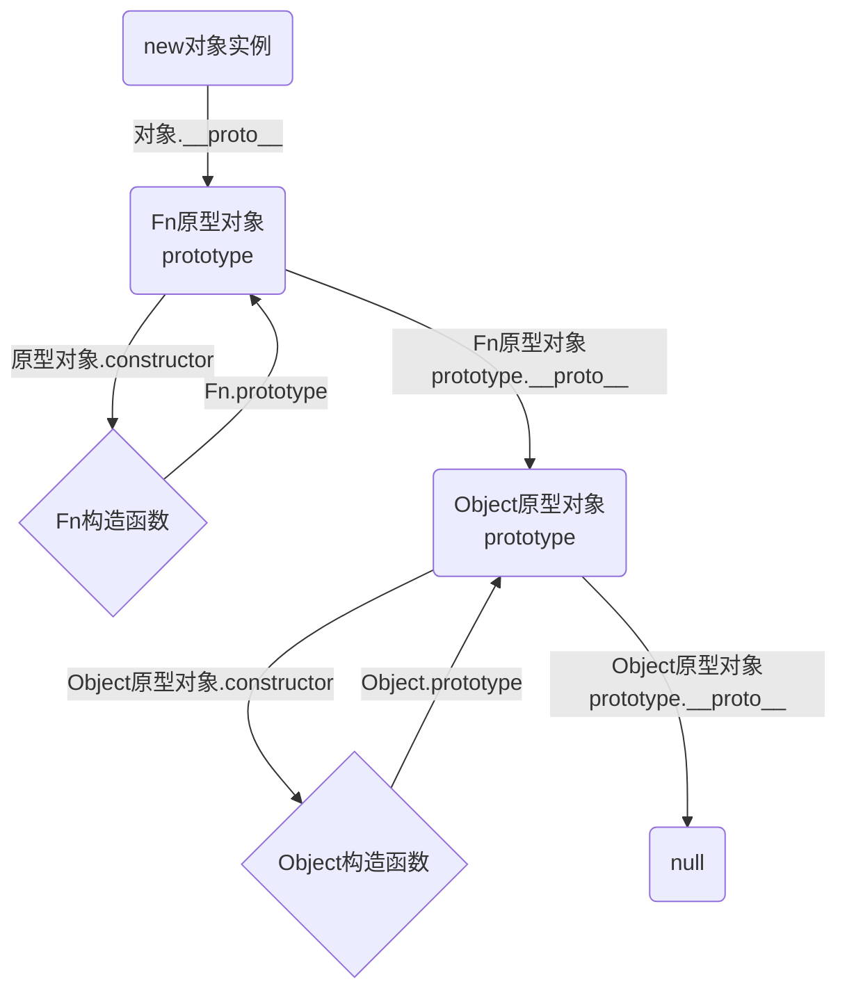

# javascript面向对象

## 面向对象编程介绍

### 两大编程思想

1、面向过程
就是按照我们分析好了的步骤，按照步骤解决问题。

**2、面向对象**
是以对象功能来划分问题，而不是步骤。

面向对象的特性：
封装性、继承性、多态性

面向对象的思维特点：
1、抽取（抽象）对象共用的属性和行为组织（封装）成一个类（模板）
2、对类进行实例化，获取类的对象

#### 对象

对象是一个具体的事物。
在javascript中，对象是一组无序的相关属性和方法的集合，所有的事物都是对象。
对象是由属性和方法组成的。

属性：事物的特征，在对象中用属性来表示（常用名词）
方法：事物的行为，在对象中用方法来表示（常用动词）

#### 类

**类**抽象了对象的公共部分，它泛指某一大类（class）
**对象**特指某一个，通过类实例化一个具体的对象

**类constructor构造函数**

constructor()方法是类的构造函数（默认方法），**用于传递参数，返回实例对象**，通过new命令生成对象实例时，自动调用该方法，如果没用显示定义，类内部会自动给我们创建一个**constructor()**

> 1、通过class关键字创建类，类名我们还是习惯性定义首字母大写
> 2、类里面有个constructor函数，可以接受传递过来的参数，同时返回实例对象
> 3、constructor函数，只要new生成实例时，就会自动调用这个函数，如果我们不写这个函数，类也会自动生成这个函数
> 4、生成实例new不能省略
> 5、最后注意语法规范，创建类，类名后面不要加个括号，生成实例，类名后面加小括号，构造函数不需要加function

类中添加方法

（1）我们类里面所有的函数不需要写function
（2）多个函数方法之间不需要添加逗号分隔

**类的继承**

1、继承
现实中的继承：子承父业。

2、super关键字
用于访问和调用对象父类上的函数，**可以调用父类的构造函数**，也可以**调用父类的普通函数**。

> 继承中的属性或者方法查找原则：就近原则
> 1、继承中，如果实例化子类输出一个方法，先看子类有没有这个方法，如果有就先执行这个子类的
> 2、继承中，如果子类里面没有，就去查找父类有没有这个方法，如果有就执行父类的这个方法（就近原则）

**注意：子类在构造函数中使用super，必须放在this前面（必须先调用父类的构造方法，再使用子类构造方法）**

**使用类注意事项：**
（1）在ES6中类没有变量提升，所以必须先定义类，才能通过类实例化对象
（2）类里面的共有的属性和方法一定要加this使用
（3）类里面的this指向问题
（4）constructor里面的this指向的是创建的实体对象

````
var that
var _that
class Xeon {
	constructor() { 
		that = this			//constructor里面的this指向的是创建的实例对象
		this.btn = document.querySelector('button')
		this.btn.onclick = this.fn2
	}
	fn() {
		_that = this		//这个方法fn里的this，指向的是实例对象wl,因为wl调用了这个函数
	}
	fn2() {
		console.log(this)		//这个方法fn2里面的this指向的是btn这个按钮，因为这个按钮调用了这个函数
		console.log(that)		//that里存储的是constructor里面的this
	}
}
var wl = new Xeon()
that === wl			//true
_that === wl    //true
````

**构造函数和原型**

构造函数是一个特殊的函数，主要用来初始化对象，即为对象成员变量赋初始值，它总与**new**一起使用。我们可以把对象中一些公共的属性和方法抽取出来，然后封装到这个函数里面。

new操作符做了四件事情：

（1）在内存中创建了一个空对象。
（2）让this指向这个创建的空对象。
（3）执行构造函数里面的代码，给这个新对象添加 属性和方法。
（4）返回这个空对象（所以构造函数里面不需要return）。

> 空对象、this、属性方法、返回****

**静态成员和实例成员**

1、实例成员：就是构造函数内部通过this添加的成员name age sex等就是实例成员
实例成员只能通过实例化的对象访问

2、静态成员：在构造函数本身上添加的成员	构造函数.属性 = 值

构造函数方法好，但是存在浪费内存的问题

#### 原型

**1、构造函数原型prototype**

构造函数通过原型分配的函数是所有对象所**共享的**。

Javascript规定，每一个构造函数都有一个prototype属性，指向另一个对象。注意这个prototype就是一个对象，这个对象的所有属性和方法，都会被构造函数所找拥有。

**我们可以把那些不变的方法，直接定义在prototype对象上，这样所有对象的实例就可以共享这些方法。**

> 构造函数.prototype.方法 = function() {}

**原型是什么**

一个对象，我们也称为prototype为**原型对象**

**原型的作用是什么**

**共享方法**

**2、对象原型``__proto__``**

对象都会有一个属性**`__proto__`**指向构造函数的prototype原型对象，之所以我们对象可以使用构造函数prototype原型对象的属性和方法，就是因为对象有`__proto__`原型的存在。

`__proto__`对象原型和原型对象prototype是等价的

````
对象.__proto__ === 构造函数.prototype				//true
````

3、constructor构造函数

原型里有一个constructor属性，告诉我们这个对象是通过那个构造函数创造出来的。

4、构造函数、实例、原型对象三者之间的关系


**5、原型链**

（1）当一个对象查找属性和方法时会从自身查找，如果查找不到则会通过`__proto__`指向被实例化的构造函数的prototype

（2）隐式原型也是一个对象，是指向我们构造函数的原型

（3）除了最顶层的Object对象没有`__proto__`，其它所有的对象都有`__proto__`，这是隐式原型

（4）隐式原型`__proto__`的作用是让对象通过它来一直往上查找属性或方法，直到找到最顶层的Object的`__proto__`属性，它的值是null，这个查找的过程就是原型链

6、Javascript的成员查找机制（规则）

（1）当访问一个对象的属性（包括方法）时，首先查找这个对象自身有没有属性。

（2）如果没有就查找它的原型（也就是`__proto__`）

（3）如果还没有就查找原型对象的原型（Object的原型对象）

（4）依此类推一直找到Object为止（nul**l）**

**7、原型对象中this指向**

（1）在构造函数中，里面this指向的是对象实例对象

（2）原型对象函数里面的this，指向的是实例对象

8、扩展内置对象

注意：数组和字符串内置对象不能给原型对象覆盖操作Array.prototype = {}，只能Array.prototype.xxx = function(){}的方式。

#### 继承

**call()**
调用这个函数，并且修改函数运行时的this指向

````
fun.call(thisArg, arg1, arg2, ...)
````

thisArg：当前调用函数this的指向对象
arg1，arg2：传递的其它参数

1、call()可以调用函数
2、call()可以改变这个函数的this指向

````
 Children.prototype = new Parent()					//原形对象继承，通过new实例
 Children.prototype.constructor = Children	//constructor会被覆盖，重新指回
````

**类的本质**

1、class本质还是function（函数）
2、类的所有方法都定义在类的prototype属性上
3、类创建的实例、里面也有`__proto__`原形指向类的prototype原型对象
4、所有ES6的类它的绝大部分功能，ES5都可以做到，新的class写法只是让对象原型的写法更加清晰，更像面向对象编程的语法而已
5、所以ES6的类其实就是语法糖
6、语法糖：语法糖就是一种便捷写法，简单理解，有两种方法可以实现同样的功能，但是一种写法更加清晰、方便，那么这个方法就是语法糖

ES5中的新增方法

数组方法

迭代（遍历）方法：forEach()、map()、filter()、some()、every()；

````
forEach()
array.forEach(function(currentValue, index, arr))
````

currentValue：数组当前项的值
index：数组当前项的索引
arr：数组对象本身

````
filter()
array.filter(function(currentValue, index, arr))
````

filter()方法创建一个新的数组，新数组中的元素是通过检查指定数组中符合条件的所有元素，主要用于筛选数组
注意它直接返回一个新数组

currentValue：数组当前项的值
index：数组当前项的索引
arr：数组对象本身

````
some()
array.some(function(currentValue, index, arr))
````

some()也是查找满足条件的元素是否存在，返回的是一个布尔值，如果查找到第一个满足条件的元素就终止循环

**forEach和some区别**

some效率更高，找到唯一满足条件即返回，适用于查询ID、手机号、不存在模糊查询的数据。

**字符串方法**

trim去掉字符串两边空格

#### 对象方法

Object.keys()用于获取对象自身所有的属性（没有值）

````
Object.key(obj)
````

效果类似for...in
返回一个由属性名组成的数组

**Object.defineProperty()定义新属性或修改原有的属性**

````
Object.defineProperty(obj, prop, descriptor)
````

Obj：必需。目标对象
prop：必需。需定义或修改的属性的名字
descriptor：必需。目标属性所拥有的特性

descriptor：对象形式{}书写
value：设置属性的值，默认为undefined
writable：值是否可以重写，true|false	默认为false
enumerable：目标属性是否可以被枚举。true|false	默认为false
configurable：目标属性是否可以被删除或是否可以再次修改我。true|false	默认为false

#### 函数进阶

**1.1、函数的定义方式**

（1）函数声明方式function关键字（命名函数）

````
function fn() {}
````

（2）匿名表达式（匿名函数）

````
var fn = function() {}
````

（3）利用new Function('参数1', '参数2', '函数体')

````
var f = new Function()
````

> 所有函数都是new Function()构造函数的实例
> 函数也属于对象

**1.2、函数的调用方式**

（1）普通函数

````
function fn {
	...
}
fn();     fn.call()
````

（2）对象的方法

````
var obj = {
	fn : function() {
		...
	}
}
obj.fn()
````

（3）构造函数

````
function Fn() {
	...
}
new Fn();
````

（4）绑定事件函数

````
btn.onclick = function() {}
````

（5）定时器函数

````
setInterval(function() {}, 1000)
````

（6）立即执行函数

````
(function(){})();			或者			(function(){}())
````

**2、函数内this的指向**

这些this的指向，是当我们调用函数的时候确定的。调用方式的不同决定了this的指向不同一般指向我们的调用者。

| 调用方式     | this指向                                   |
| ------------ | ------------------------------------------ |
| 普通函数调用 | window                                     |
| 构造函数调用 | 实例对象，原型对象里面的方法也指向实例对象 |
| 对象方法调用 | 该方法所属对象                             |
| 事件绑定方法 | 绑定事件对象                               |
| 定时器函数   | window                                     |
| 立即执行函数 | window                                     |

**2.1、call方法**

（1）call()方法调用一个对象。简单理解为调用函数的方式，但是它可以改变函数的this指向。

````
fun.call(thisArg, arg1, arg2, ...)
````

（2）call()的主要作用可以实现继承

**2.2、apply**

（1）调用函数，也可以改变函数内部的this指向
（2）但是他的参数必须是数组（伪数组）
（3）apply的主要应用，比如可以利用apply借助于数学内置对象求最大值。

````
Math.max.apply(null, arr)
````

**2.3、bind()**

（1）bind()方法不会调用函数，但是能改变函数内部this指向
（2）返回的是原函数改变this之后产生的新函数

````
fun.bind(thisArg, arg1, arg2, ...)
````

返回由指定的this值和初始化参数改造的**原函数拷贝**

**2.4、call	apply	bind总结**

相同点：都可以改变函数内部的this指向

区别点：
（1）call和apply会调用函数，并且改变函数内部this指向
（2）call和apply传递的参数不一样，call传递参数aru1，aru2..形式apply必须数组形式[arg]
（3）bind不会调用函数，可以改变函数内部this指向

**主要应用场景：**
（1）call经常做继承
（2）apply经常跟数组有关系，比如借助于数学对象实现数组最大值最小值
（3）bind不调用函数，但是还想改变this指向，比如改变定时器内部的this指向

#### 3、严格模式

Javascript除了提供正常模式外，还提供了**严格模式**。ES5的严格模式是采用具有限制性Javascript变体的一种方式，即在严格的条件下运行JS代码

3.2、开启严格模式
严格模式可以应用到整个脚本或个别函数中。因此在使用时，我们可以将严格模式分为为脚本开启严格模式和为函数开启严格模式两种情况。

````
'use strict'    
-----------------------------------
(function() {
	'use strict'
})()
//下面的js，代码就会按照严格模式执行代码。
````

````
function fn() {
	'use strict'
	//下面的代码按照严格模式执行
}
````

严格模式对javascript的语法和行为，都做了一些改变。

3.3、严格模式下this指向问题

（1）以前在全局作用域函数中的this指向window对象
**（2）严格模式下全局作用域中函数中的this是undefined**
（3）以前构造函数时不加new也可以调用，当普通函数，this指向全局对象
（4）严格模式下，如果构造不加new调用，this会报错
（5）new实例化的构造函数指向创建的对象实例
（6）定时器this还是指向window
（7）事件，对象还是指向调用者。

3.4、函数的变化

（1）函数不能有重名的参数
（2）函数必须声明在顶层

**4、高阶函数**

是对其他函数进行操作的函数，它接收函数作为参数或将函数作为返回值输出。

````
function fn(callback) {
    callback&&callback()
}
fn(function() {alert('h1')})
````

````
function fn() {
    return function() {}
}
fn()
````

