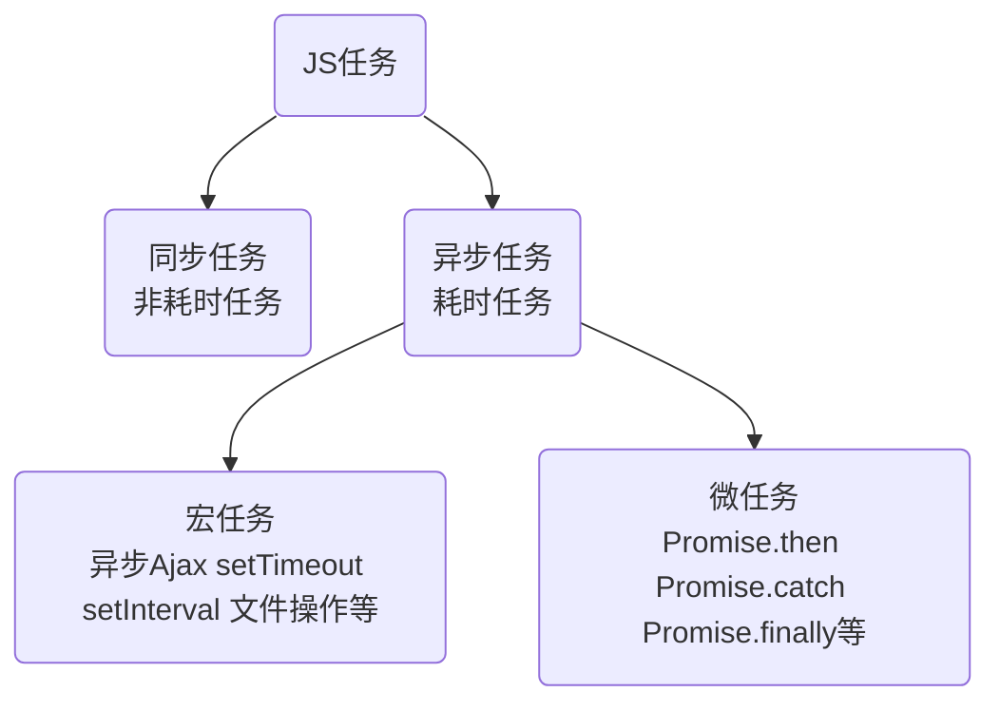
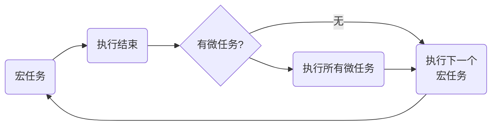

# VUE

## 学习目标

### ES6模块化

1、node.js中如何实现模块化

node.js遵循了CommonJS的模块化规范。其中：

（1）导入其它模块使用require()方法
（2）模块对外共享成员使用module.exports对象

模块化的好处：
大家都遵守同样的模块化规范写代码，**降低了沟通的成本，极大方便了各个模块之间的相互调用**，利人利己。

2、前端模块化规范的分类

在ES6模块化规范诞生之前，JavaScript社区已经尝试并提出AMD，CMD，CommonJS等模块化规范。

但是，这些由社区提出的模块化标准，还是存在一定的差异性与局限性、并不是浏览器与服务器通用的模块化标准

（1）AMD和CMD适用于浏览器端的JavaScript模块化
（2）CommonJS适用于服务器端的JavaScript模块化

3、ES6模块化规范

定义：
（1）每个js文件都是一个独立的模块
（2）导入其它模块成员使用import关键字
（3）向外共享模块成员使用export关键字

4、在node.js中体验ES6模块化

node.js中默认仅支持CommonJS模块化规范，若想基于node.js体验与学习ES6的模块化语法，可以按照如下两个步骤进行配置：
（1）安装v14.15.1以上版本的node.js
（2）在package.json的根节点中添加"type": "module"节点

5、ES6模块化的基本语法
（1）默认导出与默认导入
（2）按需导出与按需导入
（3）直接导入并执行模块中的代码

​	5.1、默认导出
​	export default 默认导出的成员

````
let n1 = 10
function fn() {}
export default {
	n1,
	show
}
````

​	默认导入
​	import 接收名称 from '模块路径/模块标识符'

````
import a1 from './路径'
````

​	注意事项

​	默认导出
​	每个模块中，只允许使用唯一的一次export default，否则会人报错

​	默认导入
​	接收名称，只要是合法的成员名称

5.2、按需导出

按需导出的语法：export按需导出的成员

````
export let a1 = 'aaa'
export function say() {}
````

````
import {a1, say} form './路径'
````

按需导出与按需导入的注意事项
（1）每个模块中可以使用**多次**按需导出
（2）按需**导入的成员名称**必须和**按需导出的名称**保持一致
（3）按需导入时，可以使用**as关键字**进行生命名
（4）按需导入可以和默认导入一起使用

5.3、直接导入并执行模块中的代码
如果只想单纯地执行某个模块中的代码，并不需要得到模块中向外共享的成员。此时，可以直接导入并执行模块代码

````
console.log(1)
````

````
import './路径'
````
### Promise

1、回调地狱
多层回调函数的相互嵌套，就形成了回调地狱

缺点：

代码耦合性太强，牵一发而动全身，难以维护
大量冗余的代码相互嵌套，代码的可读性变差

为了解决回调地狱的问题，ES6中新增了Promise的概念

1.2、Promise的基本概念

（1）Promise是一个构造函数
	我们可以创建Promise的实例 const p = new Promise()
	new 出来的Promise实例对象，代表一个异步操作
（2）Promise.prototype上包含一个.then()方法
	每一次new Promise()构造函数得到的实例对象
	都可以通过原型链的方式访问到.then()方法，例p.then()
（3）.then()方法用来预先指定成功和失败的回调函数
	p.then(成功的回调函数，失败的回调函数)
	p.then(result =>, error=>{})
	调用.then()方法时，成功的回调函数都是必选的、失败的回调函数是可选的

2、基于回调函数按顺序读取文件的内容

3.1、基于then-fs读取文件内容

调用then-fs提供的readFile()方法，可以异步地读取文件的内容，它的返回值是Promise的实例对象。因些可以调用.then()方法为每个Promise异步操作指定成功和失败之后的回调函数

````
import thenFs from 'then-fs'
````

**3.2、.then()方法的特性**

如果上一个.then()方法中**返回了一个新的Promise实例对象**，则可以通过下一个.then()继续进行处理。通过.then()方法的**链式调用**，就解决了回调地狱的问题。

3.3、基于Promise按顺序读取文件的内容

**Promise支持链式调用**

3.4、通过.catch捕获错误

**3.5、Promise.all()方法**

Promise.all()方法会发起并行的Promise异步操作，等所有的异步操作全部结束后才会执行下一步的.then操作（等待机制）。示例代码如下：

````
const promiseArr = [
    thenFs.readFile('./files/01.txt', 'utf-8'),
    thenFs.readFile('./files/02.txt', 'utf-8'),
    thenFs.readFile('./files/03.txt', 'utf-8')
]
Promise.all(promiseArr).then(result => {
    console.log(result);			//  [ '111', '222', '333' ]
})
````

**3.6、Promise.race()方法**

Promise.race()方法会发起并行的Promise异步操作，只要任何一个异步操作完成 ，就立即执行下一步的.then操作（赛跑机制）。示例代码如下：

````
const promiseArr = [
    thenFs.readFile('./files/01.txt', 'utf-8'),
    thenFs.readFile('./files/02.txt', 'utf-8'),
    thenFs.readFile('./files/03.txt', 'utf-8')
]
Promise.race(promiseArr).then(result => {
    console.log(result);			//  111或222或333
})
````

4、基于Promise封装读取文件的方法

方法的封装要求：
（1）方法的名称要定义为getFile
（2）方法接收一个形参fpath，表示要读取的文件的路径
（3）方法的返回值为Promise实例对象

````
function getFile(fpath) {
	return new Promise()
}
````

4.2、创建具体的异步操作

````
function getFile(fpath) {
	return new Promise(function() {
		fs.readFile(fpath, 'utf-8', (err, dataStr) => {})
	})
}
````

4.3、获取.then的两个实参

通过.then()指定的成功和失败的回调函数，可以在function的形参中进行接收。

````
function getFile(fpath) {
	return new Promise(function(resolve, reject) {
		fs.readFile(fpath, 'utf-8', (err, dataStr) => {})
	})
}
getFile('./路径').then(成功的回调函数，失败的回调函数)
````

4.4、调用resolve和reject回调函数

Promise**异步操作的结果**，可以调用**resolve**或**reject**回调函数进行处理。

````
function getFile(fpath) {
	return new Promise(function(resolve, reject) {
		fs.readFile(fpath, 'utf-8', (err, dataStr) => {
    	if (err) return reject(err)
      resolve(dataStr)
    })
	})
}
getFile('./路径').then((r1) => {console.log(r1)}).catch(err => console.log(err.message))
````

### async/await

1、什么是async/await
**async/await**是**ES8**引入的新语法，用来简化Promise异步操作。在这之前，只能通过**链式.then()的方式**处理Promise异步操作。

2、async/await的基本使用

````
import thenFs from 'then-fs'

async function getAllFile() {
    const r1 = await thenFs.readFile('./files/01.txt', 'utf-8')
    console.log(r1)
}
getAllFile()		//不加async/await得到的是Promise的实例
````

3、async/await的**使用注意事项**

（1）如果在function中使用了await，则function**必须**被async修饰
（2）在async方法中，**第一个await之前的代码会同步执行**，await之后的代码会异步执行

### EventLoop

1、JavaScript是单线程的语言
JavaScript是一门单线程执行的编程语言。也就是说，同一时间只能做一件事情。

> 单线程执行任务队列的问题：
> 如果**前一个任务非常耗时**，则后续的任务就不得不一直等待，从而导致**程序假死**的问题。

2、同步任务和异步任务
为了防止某个**耗时任务**导致程序假死的问题，JavaScript把待执行的任务分为了两类：
（1）**同步任务**（synchronous）

- 又叫做**非耗时任务**，指的是在主线程上排队执行的那些任务

- 只有前一个任务执行完毕，才能执行后一个任务

（2）异步任务（asynchronous）

- 又叫做**耗时任务**，异步任务由JavaScript**委托给**宿主环境进行执行。
- 当异步任务执行完成后，会**通知JavaScript主线程**执行异步任务的**回调函数**。

3、同步任务和异步任务的执行过程

（1）同步任务由JavaScript主线程次序执行
（2）异步任务**委托给**宿主环境执行
（3）已完成的异步任务**对应的回调函数**，会被加入到任务队列中等待执行
（4）JavaScript主线程的**执行栈**被清空后，会读取任务队列中的回调函数，次序执行
（5）**JavaScript主线程不断重复上面的第4步**

4、EventLoop的基本概念

**JavaScript主线程从"任务队列"中读取异步任务的回调函数，放在执行栈中依次执行**。这个过程是循环不断的，所以整个的这种运行机制又称为**EventLoop**（事件循环）

### 宏任务和微任务

1、什么是宏任务和微任务

JavaScript把异步任务又做了进一步的划分，异步任务又分为两类，分别是：

（1）宏任务（macrotask）

- 异步Ajax请求

- setTimeout、setInterval

- 文件操作

- 其它宏任务

（2）微任务（microtask）

- Promise.then、.catch和.finally

- process.nextTick

- 其它微任务



2、宏任务和微任务的执行顺序



每一个宏任务执行完之后，都会检查是否存在待执行的微任务，如果有，则执行完所有微任务之后，再继续执行下一个宏任务。

### 接口案例
1、案例需求
基于MySQL数据库 + Express 对外提供用户列表的API接口服务。用到的技术点如下：

- 第三方包express和mysql2

- ES6模块化

- Promise

- async/await

2、主要的实现步骤
（1）搭建项目的基本结构
（2）创建基本的服务器
（3）创建db数据库操作模块
（4）创建user_ctrl业务模块
（5）创建user_router路由模块

3、搭建项目的基本结构

（1）启用ES6模块化支持

- package.json中声明"type": "module"

（2）安装第三方依赖包
- 运行npm install express@4.17.1 mysql2@2.2.5

4、创建基本的服务器

````
import express from 'express'
const app = express()
app.listen(80, ()=> {
    console.log('server running at http://127.0.0.1')
})
````

5、创建db数据库操作模块

````
import mysql from 'mysql2'
const pool = mysql.createPool({
    host: '127.0.0.1',
    port: 3306,
    deatabase: 'my_db_01',	//请填写要操作的数据库的名称
    user: 'root',
    password: 'admin123'
})
export default pool.promise()
````

6、创建user_ctrl模块

````
import db from '../db/index.js'
//使用ES6的按需导出语法，将getAllUser 方法导出去
export async function getAllUser(req, res) {
    const result = await db.query('select * from ev_users')
    res.send({
        status: 0,
        message: '获取用户列表数据成功',
        data: roms
    })
}
````

7、创建user_router模块

````
import express from "express";
// 从 user_ctrl.js 模块中按需导入 getAllUser 函数
import { getAllUser } from "../controller/user_ctrl.js";

// 创建路由对象
const router = new express.Router()
// 挂载路由规则
router.get('/user', getAllUser)

// 使用 ES6 的默认导出语法，将路由对象共享出去
export default router
````

8、导入并挂载路由模块

````
import express from 'express'
// 1、使用默认导入语法，导入路由对象
import userRouter from './router/user_router.js'
const app = express()

// 2、挂载用户路由模块
app.use('/api', userRouter)

app.listen(80, ()=> {
    console.log('server running at http://127.0.0.1')
})
````

9、使用try...catch捕获异常

````
export async function getAllUser(req, res) {
	// 使用 try...catch 捕获 Promise 异步任务中产生的异常错误，并在 catch 块中进行处理
	try {
		// ev_users 表中没有 xxx 字段，所以此 SQL 语句会"执行异常"
		const [rows] = await db.query('select * from ev_users')
		res.send({ status: 0, message: '获取用户列表数据成功!', data: rows})
	} catch (e) {
		res.send({ status: 1, message: '获取用户列表数据失败!', data: e.message})
	}
}
````

### 总结

（1）能够知道如何**使用ES6的模块化语法**
- 默认导出与默认导入，按需导出与按需导入

（2）能够知道如何**使用Promise解决回调地狱问题**

- promise.**then**()、promise.**catch**()

（3）能够使用**async/await**简化Promise的调用

- 方法中用到了await，则方法需要被async修饰

（4）能够说出什么是EventLoop

- **EventLoop示意图**

（5）能够说出宏任务和微任务的执行顺序

- 在执行下一个宏任务之前，**先检查是否有待执行的微任务**

## Vue 基础

### 前端工程化

1、 小白眼中的前端开发 vs 实现的前端开发

小白眼中：网上搜代码下载自己用

实现的前端开发

- **模块化** (js 的模块化、css 的模块化、资源的模块化)
- **组件化** (复用现有的 UI 结构、样式、行为)
- **规范化** (目录结构的划分、编码规范化、接口规范化、文档规范化、 Git 分支管理) 
- **自动化** (自动化构建、自动部署、自动化测试)

2、什么是前端工程化

前端工程化指的是：在**企业级的前端项目开发**中，把前端开发所需的工具、技术、流程、经验等进行规范化、 标准化。

企业中的 Vue 项目和 React 项目，都是基于**工程化的方式**进行开发的。 

好处:前端开发**自成体系**，有一套**标准的开发方案和流程**。

3、前端工程化的解决方案

早期的前端工程化解决方案:
- grunt( https://www.gruntjs.net/ )
- gulp( https://www.gulpjs.com.cn/ )

目前主流的前端工程化解决方案:
- webpack( https://www.webpackjs.com/ ) 
- parcel( https://zh.parceljs.org/ )

### webpack 的基本使用

1、什么是webpack

概念:webpack 是**前端项目工程化的具体解决方案**。 

主要功能:它提供了友好的**前端模块化开发**支持，以及**代码压缩混淆**、**处理浏览器端 JavaScript 的兼容性**、**性**
**能优化**等强大的功能。

好处:让程序员把**工作的重心**放到具体功能的实现上，提高了前端**开发效率**和项目的**可维护性**。 

> 注意:目前 Vue，React 等前端项目，基本上都是基于 webpack 进行工程化开发的。

2、创建列表隔行变色项目

1 新建项目空白目录，并运行 npm init –y 命令，初始化包管理配置文件 package.json 
2 新建 src 源代码目录
3 新建 src -> index.html 首页和 src -> index.js 脚本文件
4 初始化首页基本的结构
5 运行 npm install jquery –S 命令，安装 jQuery
6 通过 ES6 模块化的方式导入 jQuery，实现列表隔行变色效果

3、在项目中安装 webpack

在终端运行如下的命令，安装 webpack 相关的两个包：

npm install webpack@5.42.1 webpack-cli@4.7.2 -D

````
{
  "dependencies": {   // 项目开发与上线都需要的插件
  },
  "devDependencies": {    // 只在项目开发阶段需要的插件
  }
}
````

````
npm install --save-dev
npm install --save
npm install -D   //  --save-dev的缩写
npm install -S	 //	 --save的缩写
````

4、在项目中配置 webpack

（1）在项目根目录中，创建名为 webpack.config.js 的 webpack 配置文件，并初始化如下的基本配置:

（2）在 package.json 的 scripts 节点下，新增 dev 脚本如下:

（3）在终端中运行 npm run dev 命令，启动 webpack 进行项目的打包构建

4.1、mode的可选值

mode 节点的可选值有两个，分别是：

（1）development

- **开发环境**
- **不会**对打包生成的文件进行**代码压缩**和**性能优化**
- 打包**速度快**，适合在**开发阶段**使用

（2）production

- **生产环境**
- **会**对打包生成的文件进行**代码压缩**和**性能优化**
- 打包**速度很慢**，仅适合在项目**发布阶段**使用

4.2、webpack.config.js文件的作用

webpack.config.js 是 webpack 的配置文件。webpack 在真正开始打包构建之前，会先**读取这个配置文件**， 从而基于给定的配置，对项目进行打包。

注意:由于 webpack 是**基于 node.js 开发出来的**打包工具，因此在它的配置文件中，支持使用 node.js 相关 的语法和模块进行 webpack 的个性化配置。

4.3、webpack 中的默认约定
在 webpack 4.x 和 5.x 的版本中，有如下的默认约定：
（1）默认的打包入口文件为 **src** -> **index.js**
（2）默认的输出文件路径为 dist -> **main.js**
注意:可以在 **webpack.config.js** 中修改打包的默认约定

4.4、自定义打包的入口与出口

在 webpack.config.js 配置文件中，通过 entry 节点指定打包的入口。通过 output 节点指定打包的出口。 示例代码如下：

````
const path = require('path')    // 导入 node.js 中专门操作路径的模块

module.exports = {
    entry: path.join(__dirname, './src/index.js'),      // 打包入口文件的路径
    output: {
        path: path.join(__dirname, './dist'),       // 输出文件的存放路径
        filename: 'main.js'       // 输出文件的名称
    }
}
````

### webpack 中的插件

1、webpack 插件的作用
通过安装和配置第三方的插件，可以**拓展 webpack 的能力**，从而让 webpack **用起来更方便**。最常用的 webpack 插件有如下两个：
（1）**webpack-dev-server**

- 类似于 node.js 阶段用到的 nodemon 工具
- 每当修改了源代码，webpack 会自动进行项目的打包和构建

（2） **html-webpack-plugin**

- webpack 中的 HTML 插件(类似于一个模板引擎插件) 
- 可以通过此插件自定制 index.html 页面的内容

2、webpack-dev-server

**webpack-dev-server** 可以让 webpack **监听项目源代码的变化**，从而进行**自动打包构建。**

2.1、安装 webpack-dev-server

运行如下的命令，即可在项目中安装此插件：
npm install **webpack-dev-server**@3.11.2 -D

2.2、配置 webpack-dev-server

（1）修改 package.json -> scripts 中的 dev 命令如下:

````
  "scripts": {
    "dev": "webpack serve"		//script 节点下的脚本，可以通过 npm run 执行
  }
````

（2）再次运行 **npm run dev** 命令，重新进行项目的打包
（3）在浏览器中访问 http://localhost:8080 地址，查看自动打包效果

> 注意：webpack-dev-server 会启动一个**实时打包的 http 服务器**

2.3、打包生成的文件哪儿去了?
（1）不配置 webpack-dev-server 的情况下，webpack 打包生成的文件，会存放到**实际的物理磁盘**上 

- 严格遵守开发者在 webpack.config.js 中指定配置

- 根据 **output 节点**指定路径进行存放

（2）配置了 webpack-dev-server 之后，打包生成的文件**存放到了内存中** 

- 不再根据 output 节点指定的路径，存放到实际的物理磁盘上

- **提高了**实时打包输出的**性能**，因为内存比物理磁盘速度快很多

2.4、生成到内存中的文件该如何访问?

webpack-dev-server 生成到内存中的文件，默认**放到了项目的根目录中**，而且是**虚拟的**、**不可见的**。 

- 可以直接用 **/** 表示**项目根目录**，**后面跟上要访问的文件名称**，即可访问内存中的文件
- 例如 **/bundle.js** 就表示要访问 webpack-dev-server 生成到内存中的 bundle.js 文件

3、html-webpack-plugin

html-webpack-plugin 是 **webpack 中的 HTML 插件**，可以通过此插件**自定制** index.html **页面的内容**。
**需求**：通过 html-webpack-plugin 插件，将 src 目录下的 index.html 首页，**复制到项目根目录中一份!**

3.1、安装 html-webpack-plugin

运行如下的命令，即可在项目中安装此插件：

npm install **html-webpack-plugin**@5.3.2 -D